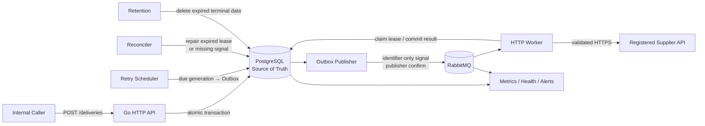

# 可靠外部 HTTP 通知服务

这是一个面向企业内部系统的可靠 HTTP(S) 通知服务。业务系统提交目标
`destination_id`、最终请求 Header 和 Body 后即可结束请求；服务负责持久化任务，
并异步调用预注册的外部供应商 API。

当前仓库已经完成最小可运行 MVP：Go 服务、PostgreSQL、RabbitMQ、数据库迁移、
测试用 HTTPS Supplier，以及从接收、异步投递、失败重试到人工 Replay 的完整链路
均可通过 Docker Compose 运行。

> 当前目标是验证可靠投递模型，而不是直接满足生产部署要求。生产化所需能力及
> 可复用设计见[从 MVP 演进到生产](#从-mvp-演进到生产)。

## 对问题的理解

这个问题的核心不是“发送一次 HTTP 请求”，而是让业务系统能够放心地把不可靠的
外部调用交给一个独立服务处理。

### 异步响应不等于可靠接收

业务系统不等待 Supplier 响应，因此 API 返回成功只能表示通知任务已经被可靠接收，
不能表示 Supplier 已经完成业务操作。本项目规定：

- 只有 `delivery` 和初始 Outbox event 在同一个 PostgreSQL 事务中提交后才返回
  `202 Accepted`。
- PostgreSQL 是任务状态、重试计划、幂等记录和审计记录的唯一事实源。
- RabbitMQ 不保存业务事实，只承载可以从 PostgreSQL 重建的 identifier-only
  dispatch signal。

### 普通 HTTP 无法保证 Exactly-once

Supplier 可能已经处理请求，但 Worker 在提交本地成功状态前崩溃。此时“不重试”
会丢失通知，“重试”又可能产生重复副作用。因此系统采用明确的
At-least-once 语义：

- 同一逻辑任务可能被重复发送。
- 每个任务使用稳定的 Supplier idempotency value。
- 当前 MVP 只接入支持幂等机制的 Supplier。
- `succeeded` 只表示 Supplier 返回了配置认可的 HTTP 响应，不表示其后续业务一定
  完成。

### 数据库与消息队列之间不能直接双写

如果先提交数据库再直接发布消息，进程可能在两步之间崩溃，使已接受任务永久沉默；
反过来先发消息也可能让 Worker 看到尚未提交的任务。项目使用
Transactional Outbox 消除这个非原子窗口：

1. API 在一个数据库事务中写入 delivery 和 Outbox event。
2. Publisher 异步发布 Outbox event，并等待 RabbitMQ publisher confirm。
3. 发布确认后再记录 `published_at`。
4. 不确定窗口允许重复 signal，但不会创建第二个逻辑 delivery。

### 外部 HTTP 调用同时是安全边界

如果 Caller 能控制 URL、认证 Header 或重定向目标，服务就可能成为携带内部凭据的
SSRF Proxy。因此 URL 和安全策略必须预注册并版本化；实际发送前仍需执行 DNS/IP
校验，将已验证 IP 固定到真实 socket，同时保留注册 hostname 做 TLS verification。

### 慢 Supplier 不能破坏整个系统

不同 Destination 的超时、限流和故障相互独立。Worker 在取得 Destination capacity
前不持有 delivery lease；容量不足时，将同一 identifier-only signal 写入 durable
delay queue 后释放 RabbitMQ consumer credit，避免一个慢目标占满全部 Worker。

## 整体架构与核心设计



这些名称代表逻辑职责，不代表必须拆成多个 Microservice。MVP 将 API、Publisher、
Worker、Scheduler、Reconciler、Retention 和告警循环放在同一应用进程中，减少本地
部署复杂度；PostgreSQL、RabbitMQ 和 Supplier 是独立进程。

### 组件职责

| 组件 | 核心职责 |
|---|---|
| API | Caller 鉴权、Destination 授权、输入校验、幂等提交、状态查询和审计 Replay |
| PostgreSQL | 保存 delivery、generation、lease、attempt、Outbox 和 replay audit；决定唯一有效状态 |
| Outbox Publisher | 领取未发布事件、发送 durable signal、等待 publisher confirm 后记录发布结果 |
| RabbitMQ | 分发 `delivery_id + generation + trace_id`；提供 manual ACK、redelivery、delay 和 DLQ |
| Worker | 校验当前 generation、取得目标容量、领取有限 lease、安全发送 HTTPS、提交结果后 ACK |
| Retry Scheduler | `next_attempt_at` 到期后为当前 generation 创建 Outbox，不推进 generation |
| Reconciler | 修复过期 lease 或可证明缺失的 signal，不替代正常重试调度 |
| Retention | 删除超过 7 天的成功任务和超过 30 天的永久失败任务，不删除活动任务 |

### 一次通知的关键时序

```mermaid
sequenceDiagram
    participant C as Caller
    participant A as API
    participant P as PostgreSQL
    participant O as Outbox Publisher
    participant Q as RabbitMQ
    participant W as Worker
    participant S as Supplier

    C->>A: POST /deliveries + Idempotency-Key
    A->>P: BEGIN; INSERT delivery + Outbox; COMMIT
    P-->>A: committed
    A-->>C: 202 Accepted

    O->>P: claim unpublished Outbox
    O->>Q: publish identifier-only signal
    Q-->>O: publisher confirm
    O->>P: mark published

    Q->>W: delivery_id + generation + trace_id
    W->>P: check eligibility
    W->>W: reserve destination capacity
    W->>P: atomically claim fenced lease
    W->>S: validated HTTPS + stable idempotency value
    S-->>W: HTTP response
    W->>P: commit attempt and state transition
    W-->>Q: ACK after commit
```

### 状态、Generation 与 Fencing

```text
new transaction  -> pending
pending          -> delivering
delivering       -> succeeded
delivering       -> pending             (retryable result)
delivering       -> failed_permanent    (permanent failure or deadline)
delivering       -> pending             (expired lease recovery)
failed_permanent -> pending             (audited replay)
```

- 接收任务时创建 generation `0`。
- Worker 提交 retryable result 时立即推进 generation，并写入未来的
  `next_attempt_at`；Scheduler 到期时只创建该 generation 的 Outbox。
- 每个 Worker 结果都必须匹配 `delivery_id`、`generation`、`delivering` 状态、
  `lease_owner`、`lease_token` 和未过期 lease。
- 旧 signal、重复 signal 或过期 Worker 的更新影响零行，不得覆盖新状态。
- HTTP 结果和下一步计划先提交 PostgreSQL，再 ACK RabbitMQ。

## 技术选型

| 范畴 | 选型 | 选择原因 |
|---|---|---|
| Language | Go 1.26.x | 单二进制、并发模型直接、标准库网络与 TLS 能力完整 |
| HTTP | `net/http` + `ServeMux` | 当前路由和 Middleware 需求不需要额外 Framework |
| Database | PostgreSQL 18 + `pgx/v5` | 事务、条件更新、`SKIP LOCKED`、索引和显式 fencing SQL |
| Message Queue | RabbitMQ + `amqp091-go` | Durable queue、publisher confirm、manual ACK、redelivery 和 DLQ |
| Migration | `golang-migrate` | 有序版本、锁和 dirty-version 检查 |
| Metrics | Prometheus Go client | 暴露低基数 Counter/Gauge 和标准 Prometheus endpoint |
| Local Runtime | Docker Compose | 一条命令启动完整依赖，并支持隔离、可重复的 Integration Test |

项目没有引入 ORM、第三方 HTTP Router、Redis、Testcontainers 或 Mocking
Framework。当前需求可以由显式 SQL、Go standard library 和少量成熟依赖清晰表达，
减少了 MVP 的概念与运维负担。

## MVP 已实现能力

- Caller API Key 鉴权与 Destination 级授权。
- 256 KiB Header/Body 限制和 Caller-scoped idempotency。
- 不可变 Destination version；已接受任务始终绑定接收时版本。
- Transactional Outbox、durable identifier-only signal 和 publisher confirm。
- At-least-once HTTPS delivery、稳定 Supplier idempotency value。
- 有限 Worker lease、完整 fencing、超时、状态码分类和 24 小时重试窗口。
- Destination 级 rate/concurrency limiter 和 durable delay queue。
- 永久失败、最近 20 次脱敏 attempt summary 和授权人工 Replay。
- 任务/Signal 恢复、终态留存、backpressure、Metrics、Liveness 和 Readiness。
- 注册目标、禁重定向、Header 保护、DNS/IP 检查、validated-IP dialing、
  TLS hostname verification、动态 Secret 解析和日志脱敏。

系统明确不承诺 Exactly-once、跨任务顺序、Supplier 后续业务结果，也不负责上游业务
事务与通知提交之间的原子性。

## 快速开始

### 环境要求

- Go 1.26.x
- Docker 和 Docker Compose
- Make、POSIX Shell、Bash、`jq`、`curl`

```sh
make preflight
make up
```

默认本地环境会启动：

- API：`http://localhost:18080`
- PostgreSQL：`localhost:15432`
- RabbitMQ AMQP：`localhost:15672`
- RabbitMQ Management：`http://localhost:25672`
- Test-only fake HTTPS Supplier

检查服务：

```sh
curl --fail http://localhost:18080/healthz
curl --fail http://localhost:18080/readyz
curl --fail http://localhost:18080/metrics
```

本地 Compose 只用于开发测试，内置凭据均为 test-only。

### 提交通知

```sh
curl --fail-with-body \
  -H 'Authorization: Bearer caller-a-test-key' \
  -H 'Idempotency-Key: registration-10001' \
  -H 'Content-Type: application/json' \
  --data '{
    "destination_id": "supplier-a",
    "method": "POST",
    "headers": {
      "Content-Type": "application/json",
      "X-Event-Type": "user.registered"
    },
    "body_base64": "eyJ1c2VyX2lkIjoiMTAwMDEifQ=="
  }' \
  http://localhost:18080/deliveries
```

`body_base64` 在这个示例中表示 `{"user_id":"10001"}`。成功响应是任务已经在
PostgreSQL 中持久化后的 `202 Accepted`，不会等待 fake Supplier。

### 查询状态

```sh
curl --fail-with-body \
  -H 'Authorization: Bearer caller-a-test-key' \
  http://localhost:18080/deliveries/<delivery-id>
```

响应包含当前状态、generation、重试时间，以及最近 20 条脱敏 attempt summary；
不会返回请求 Body、敏感 Header、Credential、Supplier idempotency value 或 lease
信息。

停止本地环境但保留开发 Volume：

```sh
make down
```

## 验证与容量证据

完整验证入口：

```sh
make verify
```

它依次执行 Preflight、Formatting、Static Analysis、module/Compose 检查、repo skill
validation、Unit Test、Hook fixture、Race Test、镜像健康检查、PostgreSQL/RabbitMQ
持久性与协议 Probe，以及隔离 Integration Test。

常用独立入口：

```sh
make lint
make test
make test-race
make verify-gate
make integration
make capacity
make verify-slice SLICE=4
```

最近一次本地容量验收在健康依赖、无现有积压、单 Worker、Destination 限制
250 req/s 和 concurrency 8 的条件下，以约 100 submissions/s 提交 200 个任务：

| 指标 | 结果 |
|---|---:|
| 返回 `202` | 200 / 200 |
| PostgreSQL 中可查询 | 200 / 200 |
| 最终成功 | 200 / 200 |
| First-attempt p99 | 1.176 s |
| First-attempt maximum | 1.669 s |

这只证明该本地 Profile 支持拟议的 `p99 <= 60s`，不是无条件 Production SLO。
完整条件和 Crash-window 证据见
[`docs/capacity-report.md`](docs/capacity-report.md)。

## 从 MVP 演进到生产

现有实现刻意保留了可以继续复用的可靠性核心。生产化通常不需要重写状态机、
Outbox、generation 或 fencing，而是替换外围 Adapter、增强部署拓扑和补齐运营能力。

| 生产需求 | MVP 当前实现 | 可能引入的技术 | 可复用与扩展方式 |
|---|---|---|---|
| Database HA 与恢复 | 单 PostgreSQL Container + named Volume | Managed PostgreSQL、PITR、跨 AZ Replica、PgBouncer | 复用 Schema、Migration、事务和 fencing SQL；通过恢复演练确定 RPO/RTO |
| Queue HA | 单 RabbitMQ Container | Managed RabbitMQ 或 RabbitMQ Cluster | 保留 AMQP topology、publisher confirm、manual ACK 和 identifier-only signal |
| Secret 管理 | `EnvironmentSecrets` | HashiCorp Vault、AWS Secrets Manager、GCP Secret Manager 或 Azure Key Vault | 实现现有 `SecretProvider` interface；Destination 仍只保存 `secret_ref` |
| 出站网络控制 | 应用层 SSRF Policy | Egress Proxy、Firewall、Kubernetes NetworkPolicy、Cloud NAT allowlist | 保留 URL/DNS/IP/TLS 校验，并用独立网络层做第二道强制控制 |
| 多 Worker 水平扩展 | 单 Worker + in-process limiter | Redis-based limiter、PostgreSQL coordination 或独立 Rate-limit Service | Worker lease/fencing 可直接复用；先通过新 ADR 选择共享 limiter |
| Caller 与 Destination 管理 | 本地启动 Bootstrap 单个测试 Caller/Destination | Admin API、GitOps 配置或内部 Control Plane | 复用不可变 Destination version、Caller allowlist 和审计模型 |
| 身份认证 | 静态 Caller API Key | API Gateway、mTLS、OIDC/OAuth 2.0、Workload Identity | 将认证替换在 API 边界，不改变 delivery 数据流 |
| Observability | Prometheus Metrics + structured `slog` | Prometheus、Grafana、Alertmanager、OpenTelemetry、集中日志平台 | 复用现有低基数 Metrics 与 bounded error category，增加 Trace/Alert sink |
| 部署与扩缩容 | Docker Compose、单应用进程 | Kubernetes、ECS、Nomad 或企业现有 Runtime | 同一 Binary 中职责已分离为独立 Loop，可先整体部署，也可按测量结果拆分 |

如果生产平台选择 SQS、Pub/Sub 或 Kafka 而不是 RabbitMQ，需要新增 ADR 并实现新的
Signal Broker Adapter；PostgreSQL 事实源、Transactional Outbox 和 Worker fencing
仍可保留。Redis 也不是默认必需项，只有在多 Worker 实例需要严格的
Destination-global limiter 时才值得引入。

优先的生产化顺序通常是：

1. 确定 Managed PostgreSQL、Backup/PITR、RPO 和 RTO。
2. 接入 Secret Manager 与独立 Egress Control。
3. 建立 Caller/Destination 的配置发布和审计流程。
4. 接入 Dashboard、Alerting、Tracing 和集中日志。
5. 根据真实容量数据决定是否拆分职责、横向扩展 Worker，以及是否需要共享 limiter。

## 仓库导航

```text
cmd/                 应用、fake Supplier 和 Toolchain Probe 入口
internal/            Delivery、Dispatch、Outbound 与 Worker 实现
migrations/          PostgreSQL Schema Migration
test/integration/     按故障场景组织的 Integration Test
testdata/             Test-only TLS Fixture
docs/                Product Spec、Architecture、ADR、执行计划和运维说明
.agents/skills/      Repository-level Codex Skill
.codex/              Codex Hook 与 Fixture
```

- [`docs/product-spec.md`](docs/product-spec.md)：外部行为、范围和非目标
- [`docs/architecture.md`](docs/architecture.md)：组件边界、状态机与 Failure Model
- [`docs/adr/`](docs/adr/)：架构决策及取舍
- [`docs/exec-plan.md`](docs/exec-plan.md)：纵向 Slice 与可执行验收证据
- [`docs/operations.md`](docs/operations.md)：本地恢复与 Replay 操作
- [`AGENTS.md`](AGENTS.md)：Repository Automation Agent 的工程规则

测试证书和 Private Key 仅用于 fake Supplier，禁止用于真实环境或存放真实 Credential。
